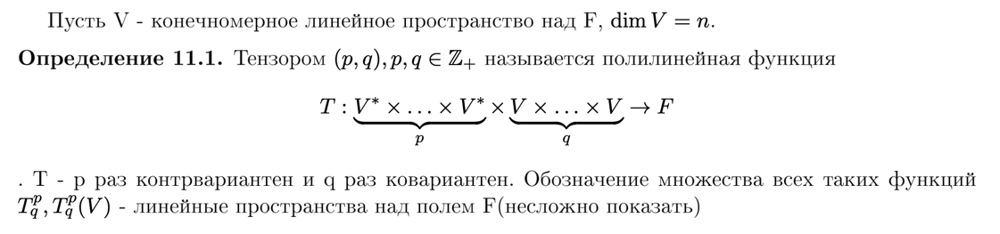
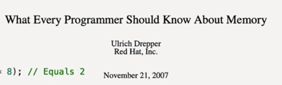

## Тензоры

В C++ эффективнее всего хранить тензор не как «массив массивов», а как непрерывный блок памяти (flat buffer). Это критически важно для производительности и кэш-оптимизации

Для доступа к элементу по индексам $(b, i, j)$, где $b$ — индекс батча, $i$ — строка, $j$ — столбец, используется формула смещения (Row-Major layout):$$Index(b, i, j) = b \cdot (S \cdot D) + i \cdot D + j$$Где:$S$ — длина последовательности (seq_len).$D$ — размерность вектора (d_k или d_v).

---

«Как полилинейность связана с эффективностью на GPU?»

Ответ: Полилинейность позволяет разбивать сложные вычисления на серию простых матричных умножений (как в твоем задании с Attention). Это идеально параллелится.

---

НАДО ПРОПИСАТЬ, ЧТО MOVE КОНСТРУКТОРЫ И ОПЕРАТОРЫ ПРИСВАИВАНИЯ БУДУТ СГЕНЕРИРОВАНЫ АВТОМАТИЧЕСКИ, ИЗ-ЗА RULE OF ZERO
Для класса Tensor соблюдено Rule of Zero. Перемещающие операции помечены как noexcept для обеспечения максимальной производительности в сценариях с возвратом значений и транспонированием.

---

Добавить, что matrix_mul принимает индекс конкретного батча для того, чтобы можно было распараллелить

---

Надо будет сравнить отдельное ускорение для матричного произведения и показать на сколько ускорился attention, объяснить
это поведение при помощи закона Амдала

--- 

## Не забыть про прогрев кэшов

---

## Design Decision: Matrix Multiplication Interface
Была рассмотрена возможность реализации специализированного ядра умножения Q * K.T с использованием шаблонов для изменения порядка обхода индексов «на лету» (без физического транспонирования).Однако для чистоты эксперимента и более наглядной демонстрации эффективности кэш-оптимизаций было решено оставить стандартный интерфейс умножения $A \times B$. Это позволяет:Сфокусироваться на оптимизации стандартного паттерна доступа к памяти (Column-wise access в наивном алгоритме).Сделать бенчмарки более релевантными для общего случая матричных вычислений.Явно продемонстрировать разницу в производительности при переходе от паттерна доступа $I-J-K$ к кэш-дружественному $I-K-J$.

---

Наивная версия

---

Далее смена идексов + объяснение почему это лучше работает

---

Далее тайлинг, надо сказать, что все улучшения накладываются на предыдущие

---

---

Явно объявляем Tensor(Tensor&&) = default, C++ автоматически удаляет конструктор копирования (Tensor(const Tensor&)) и оператор копирующего присваивания.

C++
Tensor A(1, 1024, 1024);
Tensor B = A; // ОШИБКА КОМПИЛЯЦИИ!

Тензоры могут весить мегабайты и гигабайты. Неявное копирование через знак = часто приводит к падениям производительности. 
Если пользователю реально нужна копия, он может запросить её явно (метод clone())

---

### Resources 

Matrix Multiplication Deep Dive || Cache Blocking, SIMD & Parallelization - Aliaksei Sala - CppCon

Attention Is All You Need

https://www.youtube.com/watch?v=eMlx5fFNoYc&t=269s

