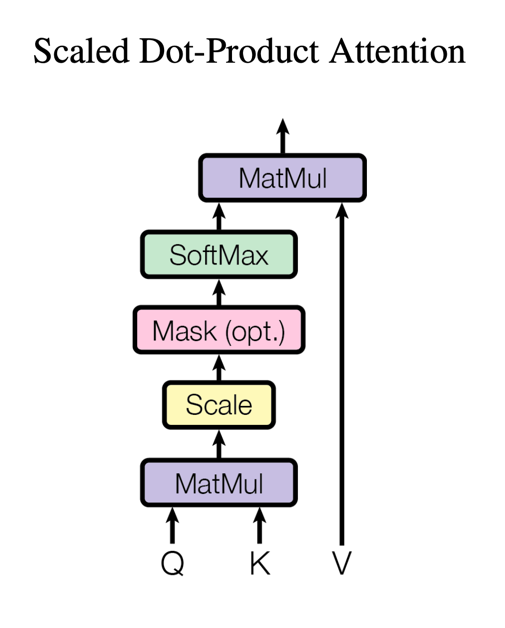
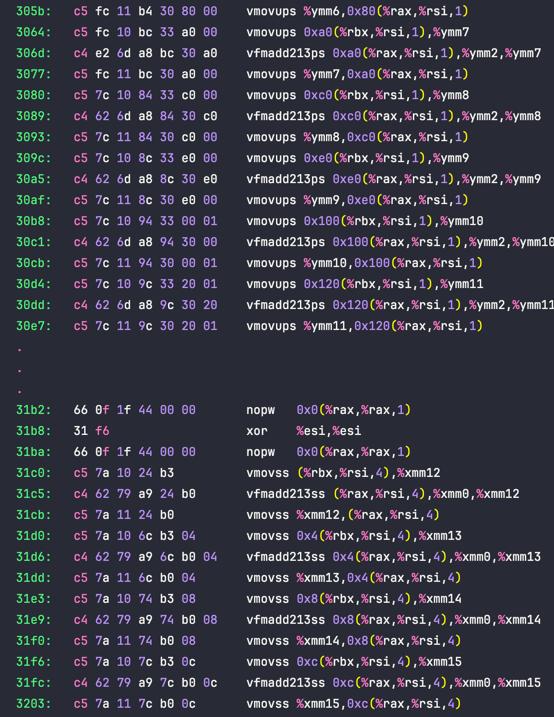

# Оптимизация функции Attention

<figure style="text-align: center; max-width: 60%; margin: 20px auto;">
  
</figure>

В данном проекте на языке C++ реализован механизм **Scaled Dot-Product Attention**, лежащий в основе архитектуры **Transformer**, впервые упомянутой в статье **«Attention Is All You Need»**.

> Проект не ставит целью реализацию архитектуры Transformer или механизмов Multi-Head Attention. Работа сфокусирована на исследовании методов оптимизации тензорных операций на уровне микроархитектуры центрального процессора.\
В данном контексте механизм Attention рассматривается исключительно в качестве вычислительной нагрузки, позволяющей оценить эффективность предложенных решений и качество управления ресурсами памяти.

## Обзор реализации

Работа была сосредоточена на оптимизации матричного умножения и анализе их взаимодействия с иерархией кэш-памяти современных процессоров.

**Ключевые этапы реализации:**

- **Архитектура тензоров:** Реализован класс `Tensor`

- **Оптимизация вычислительных ядер:** Реализованы несколько алгоритмов матричного умножения:
  - Наивный алгоритм ($O(N^3)$)
  - Cache-friendly подход с применением тайлинга (Blocking)
  - Векторизованный (SIMD) вариант
  - Также их промежуточные версии

- **Анализ:** В проекте содержится сравнение производительности всех приведённых алгоритмов и пояснение причин ускорения (или замедления) от версии к версии

---

## Hardware & Software Specifications

Все приведённые далее бенчмарки и измерения проводились на данной машине

| **Характеристика**     | **Значение**                                                         |
| ---------------------- | -------------------------------------------------------------------- |
| **CPU**                | Intel Core i5-1235U (10 ядер: 2 P-core + 8 E-core)                   |
| **L1 / L2 / L3 Cache** | **L1d:** 48KB (P) / 32KB (E); <br/>**L2:** 1.25MB (P) / 2MB (E);<br/> **L3:** 12MB |
| **OS**                 | Arch Linux (Kernel 6.17.1-arch1-1)                                   |
| **Compiler & Flags**   | GCC 15.2.1, `-O3 -march=native -DNDEBUG`                             |
| **C++ Standard**       | C++20                                                                |

> [!NOTE] 
> Далее идёт небольшое погружение в механизм Attention'а, особенности и архитектурные решения предпринятые в конкретной реализации. Для тех читателей, которым не интересны подобные детали рекомендую перейти сразу к результатам измерений _(в конце README)_

---

## Scaled Dot-Product Attention

В основе архитектуры лежит механизм внимания, вычисляемый по следующей формуле:

$$Attention(Q, K, V) = softmax\left(\frac{Q K^T}{\sqrt{d_k}}\right) V$$

### Пояснение терминов и размерностей

#### Входные тензоры

Данные обрабатываются батчами. Основные входные тензоры имеют следующие размерности:

* **$Q$ (Queries)**: Тензор размерностью `[batch_size, seq_len_q, d_k]`.
* **$K$ (Keys)**: Тензор размерностью `[batch_size, seq_len_k, d_k]`.
* **$V$ (Values)**: Тензор размерностью `[batch_size, seq_len_k, d_v]`.


* `batch_size`: Размер пакета данных (количество независимых наборов матриц).
* `seq_len_q`: Длина последовательности запросов (Query).
* `seq_len_k`: Длина последовательности ключей/значений (Key/Value).
* **$d\_k$**: Размерность эмбеддинга (вектора) ключа и запроса.
* **$d\_v$**: Размерность эмбеддинга (вектора) значений.

### Выход

Тензор размерностью `[batch_size, seq_len_q, d_v]`

### Что за тензоры вообще?

Под **тензором** понимается трехмерный массив (3D Tensor) с формой $[B \times S \times D]$, где:
* **$B$ (Batch):** количество независимых образцов в пакете. Каждый «срез» `tensor[i]` — это отдельная матрица, соответствующая конкретному примеру из набора данных.
* **$S$ (Sequence Length):** длина последовательности (количество токенов).
* **$D$ (Dimension):** размерность вектора признаков (embedding'а).

**Аналогия с датасетом:** Тензор можно представлять себе как "мини-датасет", каждый из которых состоит из матриц (Q, K, V)

### Зачем это нужно?

Тензор является полилинейным объектом. Это означает, что операции над ним можно разложить на независимые вычисления по каждой размерности. Благодаря такой структуре тензор становится идеальным кандидатом для распараллеливания.

---

## Блок-схема алгоритма

Алгоритм **Scaled Dot-Product Attention** можно представить в виде последовательности операций:

<figure style="text-align: center; max-width: 30%; margin: 20px auto;">
  

  <figcaption style="margin-top: 10px; font-style: italic; color: #555;">
    Источник: статья "Attention Is All You Need" [1]
  </figcaption>
</figure>

* **MatMul (Скалярное произведение):** Перемножение матриц запросов ($Q$) и ключей ($K^T$) для получения предварительных оценок релевантности (attention scores) запроса и ключей.

* **Scale (Масштабирование):** Деление полученных значений на $\sqrt{d\_k}$ (корень из размерности векторов). Это важно для предотвращения насыщения функции Softmax: при больших значениях скалярного произведения градиент становится малым (что бы это не значило), что ухудшает обучение.

* **Masking (Маскирование):** Механизм, исключающий влияние «будущих» токенов на предсказание текущего слова. Маска изолирует модель от информации, которая следует за предсказываемым элементом.

* **Softmax (Нормализация):** Перевод скалярных произведений в вероятностное распределение (от 0 до 1). Для каждого запроса сумма вероятностей по всем ключам равна единице. Расчёт производится по формуле:

  $$\text{softmax}(z_i) = \frac{e^{z_i}}{\sum_{j} e^{z_j}}$$

* **Value Aggregation (Взвешивание):** Финальное перемножение полученных весов с матрицей значений ($V$). Этот этап формирует итоговый вектор контекста, сдвигая представление текущего слова таким образом, чтобы учесть анализ и значимость всех предыдущих элементов последовательности.

---

## Архитектура и Структуры Данных

### Представление тензоров в памяти

Эффективным способом хранения многомерных массивов является использование непрерывного блока памяти (в данной реализации — `std::vector<float>`). Это критически важно для производительности, так как гарантирует **пространственную локальность**.

Для вычисления линейного смещения по логическим индексам $(batch_idx, row_idx, col_idx)$ применяется формула:

```C++
get_index(batch_idx, row_idx, col_idx) = batch_idx * batch_size() + row_idx * cols() + col_idx
```

### Особенности реализации

* **Поддержка аллокаторов:** Использование `template <typename Allocator>` позволяет адаптировать тензор под специализированные нужды, например, использовать `AlignedAllocator` для работы с SIMD-инструкциями (AVX/SSE) или реализовать кастомное выделение памяти.

* **Views:** Метод `getBatchView` возвращает `std::span<float>`. Это позволяет получить легковесный интерфейс к конкретному батчу без копирования данных, обеспечивая при этом безопасность доступа и поддержку алгоритмов STL.

### Move-семантика и контроль жизненного цикла
В актуальных задачах машинного обучения тензоры могут занимать гигабайты памяти, поэтому неявное копирование через оператор присваивания `=` недопустимо. Класс `tensor()` имеет следующие особенности:

* **Запрет неявного копирования:** Конструктор копирования вынесен в секцию `private`, что делает невозможным случайное дублирование данных при передаче в функции по значению.

* **Явное клонирование:** Для создания полной копии данных предусмотрен метод `clone()`. Это делает затратные операции в коде видимыми и осознанными.

* **Move-семантика:** `default` move конструктор и оператор move assignment позволяют эффективно передавать владение ресурсами.

```C++
  Tensor A(2, 512, 512);
  Tensor B = std::move(A);  // Эффективно: перенос указателей
  Tensor C = B;             // Ошибка компиляции: неявное копирование запрещено
  Tensor D = B.clone();     // Корректно: осознанное глубокое копирование
```

### Операции

Методы изменения формы тензора спроектированы с учетом минимизации вычислительных затрат:

* **Умное транспонирование:** Метод `transpose()` учитывает геометрию батча.

  * Для **квадратных матриц** внутри батча транспонирование выполняется **in-place** транспонирование.
  * Для **прямоугольных матриц** вызывается метод `transposed()`, создающий новый объект с измененными размерностями, засчёт RVO и поддержки move семантики эта функция работает оптимально в большинстве кейсов.

* **Безопасный доступ:** Все методы доступа (`operator()`, `getBatchView`) снабжены `assert`-проверками границ, что гарантирует отсутствие накладных расходов на обработку исключений в runtime, при этом делает удобной работу с классом во время отладки.

---

## AlignedAllocator

Реализован `AlignedAllocator<T, Alignment>` — кастомный аллокатор для контейнера, который гарантирует выделение памяти на специфических границах (например, 64 или 128 байт)

### Зачем это нужно?

**SIMD инструкции:** Для работы инструкций `vmovaps` (Aligned Packed Single) адрес данных **обязан** быть кратен 32 или 64 байтам. Если данные не выровнены, процессор вынужден использовать медленные инструкции `vmovups` (Unaligned Packed Single)

---

## Сигнатура функции `matMul()`

```C++
void matMul(const Tensor& lhs, const Tensor& rhs, Tensor& result, std::size_t batch_idx);
```

> [!NOTE]
> **Отказ от неявного транспонирования**\
На этапе проектирования рассматривалась возможность реализации умножения $Q \times K^T$ с использованием шаблонов (`RhsMatrixOp::Transpose`) для изменения порядка обхода индексов без физического транспонирования памяти.\
Однако для чистоты эксперимента и наглядной демонстрации эффективности кэш-оптимизаций, было принято решение **оставить стандартный интерфейс умножения $A \times B$** и явно транспонировать матрицу $K$ перед выполнением операции

---

## Описание оптимизаций матричного умножения

Процесс оптимизации разделен на несколько логических этапов. Каждое последующее улучшение накладывается на предыдущее.

### Этап 1: Наивная реализация (Naive I-J-K)

Стандартный алгоритм с порядком циклов $I \rightarrow J \rightarrow K$.

Внутренний цикл шагает по столбцам правой матрицы $B$. В памяти формата Row-Major это приводит к тому, что соседние элементы цикла находятся далеко друг от друга, что вызывает постоянные промахи кэша.

```C++
void matMulNaive(const Tensor &lhs, const Tensor &rhs, Tensor &result, const std::size_t batch_idx) {
    validateMatMul(lhs, rhs, result, batch_idx);
    auto [M, K, N] = getMatMulDimensions(lhs, rhs);

    for (std::size_t row = 0; row < M; ++row) {
        for (std::size_t col = 0; col < N; ++col) {
            for (std::size_t k = 0; k < K; ++k) {
                result(batch_idx, row, col) += lhs(batch_idx, row, k) * rhs(batch_idx, k, col);
            }
        }
    }
}
```

### Этап 2: Изменение порядка циклов (Loop Reordering I-K-J / Cache Optimized)

Смена порядка обхода на $I \rightarrow K \rightarrow J$.

Самый внутренний цикл теперь обходит элементы правой матрицы не по столбцу, а также по строке. Процессор начинает эффективно использовать кэши и аппаратный префетчер (Hardware Prefetcher).

```C++
void matMulCacheOptimized(const Tensor &lhs, const Tensor &rhs, Tensor &result, const std::size_t batch_idx) {
    validateMatMul(lhs, rhs, result, batch_idx);
    auto [M, K, N] = getMatMulDimensions(lhs, rhs);
    auto [lhs_ptr, rhs_ptr, res_ptr] = getBatchPointers(lhs, rhs, result, batch_idx);

    for (std::size_t row = 0; row < M; ++row) {
        for (std::size_t k = 0; k < K; ++k) {
            const float lhs_val = lhs_ptr[index(row, k, K)];

            for (std::size_t col = 0; col < N; ++col) {
                res_ptr[index(row, col, N)] += lhs_val * rhs_ptr[index(k, col, N)];
            }
        }
    }
}
```

### Этап 3: Блочное умножение (Cache Tiling / Blocking)

Матрицы разбиваются на независимые блоки (тайлы), размер которых (например, $160 \times 160$) подобран так, чтобы все участвующие в текущем вычислении "мини-матрицы" одновременно помещались в кэш процессора. В нашем случае значение `kBlockSize = 160` подобрано эмпирически и даёт наибольшую эффективность.

Это позволяет процессору лучше взаимодействовать с кэшем и эффективно предсказывать переходы. Ниже представлена реализация внешних циклов и самого ядра (`naive_block`): 

```C++
inline void naive_block(const float* a, const float* mb, float* c, const std::size_t N, const std::size_t K) {
    for (std::size_t row = 0; row < details::kBlockSize; ++row, c += N, a += K) {
        const float* b = mb;

        for (std::size_t k = 0; k < details::kBlockSize; ++k, b += N) {
            const float a_val = a[k];

            for (std::size_t col = 0; col < details::kBlockSize; ++col) {
                c[col] += a_val * b[col];
            }
        }
    }
}

void matMulTiling(const Tensor &lhs, const Tensor &rhs, Tensor &result, const std::size_t batch_idx) {
    validateMatMul(lhs, rhs, result, batch_idx);
    const auto [M, K, N] = getMatMulDimensions(lhs, rhs);
    auto [lhs_ptr, rhs_ptr, res_ptr] = getBatchPointers(lhs, rhs, result, batch_idx);
    validateTilingDimensions(M, K, N);

    for (std::size_t i_block = 0; i_block < M; i_block += details::kBlockSize) {
        for (std::size_t k_block = 0; k_block < K; k_block += details::kBlockSize) {
            for (std::size_t j_block = 0; j_block < N; j_block += details::kBlockSize) {
                const float* a = &(lhs_ptr[i_block * K + k_block]);
                const float* b = &(rhs_ptr[k_block * N + j_block]);
                float* c = &(res_ptr[i_block * N + j_block]);

                naive_block(a, b, c, N, K);
            }
        }
    }
}
```

### Этап 4: Векторизация (SIMD)

Явное использование процессорных интринсиков (AVX2) для параллельной обработки нескольких `float` за одну инструкцию. Внешний цикл остается такой же, как в Tiling, но вычислительное ядро заменяется на `simd_block`.

Как мы сможем заметить в таблице ниже, это не дало сильного прироста, так как `блочное умножение` (Tiling) силами современного компилятора уже эффективно использовало все `ymm` регистры, но появился один неявный плюс, к которому мы вернёмся позднее.

```C++
inline void simd_block(const float* a, const float* mb, float* c, const std::size_t N, const std::size_t K) {
    for (std::size_t row = 0; row < details::kBlockSize; ++row, c += N, a += K) {
        const float* b = mb;

        for (std::size_t k = 0; k < details::kBlockSize; ++k, b += N) {
            constexpr std::size_t kStep = 8;
            __m256 a_vec = _mm256_broadcast_ss(&a[k]);

            for (std::size_t col = 0; col < details::kBlockSize; col += kStep) {
                __m256 b_vec = _mm256_load_ps(&b[col]);
                __m256 c_vec = _mm256_load_ps(&c[col]);

                c_vec = _mm256_fmadd_ps(a_vec, b_vec, c_vec);
                _mm256_store_ps(&c[col], c_vec);
            }
        }
    }
}
```    

---

## Бенчмарки и Анализ Производительности

### Методология тестирования

1. **Прогрев кэша**: Перед началом замеров алгоритм выполняется несколько раз "вхолостую". Это исключает из статистики время на перенос данных из RAM в иерархию кэшей и подъем частот процессора.
2. **Perf**: Замерялись такты процессора (`cpu_core/cycles/u`), количество инструкций (`instructions`), ветвлений (`branches`) и промахи кэша (`cache-misses`).

### Результаты тестирования (Матрица 4000x4000, Batch = 1)

| **Алгоритм**              | **Время (ms)** | **Скорость (GFLOPS)** | **Такты процессора (Cycles)** | **Промахи кэша (Cache Misses)** |
| ------------------------- |----------------|-----------------------| ----------------------------- | ------------------------------- |
| **1. Naive (operator())** | 64 934.77      | 1.97                  | -                             | -                               |
| **2. Direct Naive (Ptr)** | 64 747.55      | 1.98                  | -                             | -                               |
| **3. Cache Optimized**    | 8 747.95       | 14.63                 | 356 559 523 996               | 33 122 215 091                  |
| **4. Tiling (Block=160)** | 2 682.36       | 47.72                 | 112 408 710 966               | 204 293 446                     |
| **5. SIMD**               | 2 620.84       | 48.84                 | 109 951 888 427               | 202 763 424                     |

> [!NOTE]
> _**Примечание:** Статистика _`Cycles`_ и _`Cache Misses`_ для Наивных реализаций опущена из-за нецелесообразности их профилирования настолько неэффективных алгоритмов._

## Выводы по результатам замеров

### **Эффективность работы с кэшем** 
Переход от `Cache Optimized` к `Tiling` привел к колоссальному падению количества промахов кэша (Cache Misses) — с 33.1 миллиардов до 204 миллионов (более чем в 160 раз). Именно локальность данных обеспечили рост производительности с 14 до 46 GFLOPS.

### **Почему же SIMD не практически не дал дополнительного ускорения по сравнению с Tiling?** 
Несмотря на явное использование AVX2 интринсиков, время работы функции `SIMD` практически идентично (а с учетом погрешности бенчмарка — иногда даже слегка уступает) алгоритму `Tiling`. Это объясняется тем, что оптимально написанный Tiling с последовательным доступом к памяти позволяет современным компиляторам (с флагами `-O3 -march=native -funroll-loops`) самостоятельно выполнить отличные оптимизации кода. 

Компилятор эффективно разворачивает внутренний цикл (loop unrolling) и задействует все доступные 256-битные регистры, делая наше вмешательство в его работу малоэффективным.

### Неочевидное преимущество явной SIMD-векторизации
Несмотря на то, что реализация Tiling практически сравнялась по скорости с явной реализацией SIMD, просмотр ассемблера показал один скрытый, но достаточно весомый плюс использования интринсиков.

В случае функции с тайлингом компилятор генерировал дополнительный, резервный блок кода. Даже при включенных агрессивных флагах оптимизации (-O3 -march=native), компилятор перестраховывается на случай, если данные не выровнены в памяти оптимальным образом или размер массивов не кратен ширине 256-битных YMM-регистров.

<figure style="text-align: center; max-width: 60%; margin: 20px auto;">
  
  <figcaption style="margin-top: 10px; font-style: italic; color: #555;">
    void matMulTiling(...) (кусок с дублирующимся кодом)
  </figcaption>
</figure>

В результате, для обычного цикла Tiling генерируется две ветки выполнения:
- **Основная ветка:** Использует широкие регистры YMM (AVX2) для выровненных и кратных блоков.

- **Запасная ветка:** Использует 128-битные XMM регистры.

**Явное использование интринсиков приводит к:**

- Уменьшению размера бинарного кода (Code Bloat): Меньше инструкций — лучше используется кэш инструкций.

- Меньшей нагрузке на бранч предиктор: Процессору не нужно тратить такты на проверку условий выравнивания перед каждым блоком данных.

## Результаты тестирования слоя Attention

| **Алгоритм**                       | **Время (ms)** | **Производительность (GFLOPS)** | **Ускорение (Speedup)** |
| ---------------------------------- | -------------- | ------------------------------- | ----------------------- |
| **1. Attention (Naive)**           | 129 390.80     | 0.99                            | 1.00x (Baseline)        |
| **2. Attention (Cache Optimized)** | 17 646.26      | 7.25                            | **7.33x**               |
| **3. Attention (SIMD)**            | **5 466.63**   | **23.41**                       | **23.67x**              |

## Resources

* Matrix Multiplication Deep Dive || Cache Blocking, SIMD & Parallelization - Aliaksei Sala - CppCon
* Attention Is All You Need (Vaswani et al., 2017)